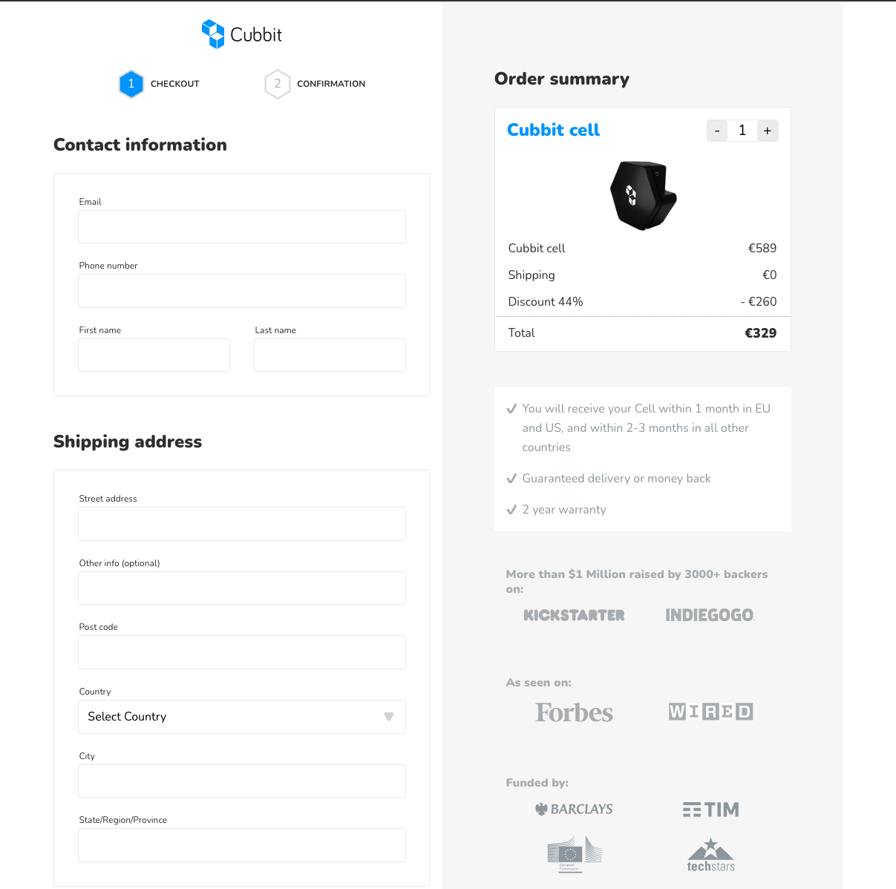

# Cubbit test App

    

This is the test app for **Cubbit** FE position.

Please clone this repo and install the dependencies.

Once running you'll find the app available on [http://localhost:3000](http://localhost:3000) and StoryBook here [http://localhost:6006](http://localhost:6006/?path=/story/base-button--button).

## Please note:

_I implemented the designs for the two pages following the mockups as strictly as possible; there were some little spacing/sizing inconcistencies in the designs though that I normalised in my implementation._

_Also, I assumed the test was to give you an overiview of my technical background and to show you how I would have built such a web ui - hence I didn't write stories and tests for all the components but just a few, to provide you with an implementation example._

---

## Preview:

The app build is available here: https://cuginoale.github.io/cubbit/#/

The confirmation page is available here: https://cuginoale.github.io/cubbit/#/thankyou

---

    

This project was bootstrapped with [Create React App](https://github.com/facebook/create-react-app).

## Available Scripts

In the project directory, you can run:

### `yarn start`

Runs the app in the development mode.\
Open [http://localhost:3000](http://localhost:3000) to view it in the browser.

The page will reload if you make edits.\
You will also see any lint errors in the console.

### `yarn test`

Launches the test runner in the interactive watch mode.\
See the section about [running tests](https://facebook.github.io/create-react-app/docs/running-tests) for more information.

### `yarn build`

Builds the app for production to the `build` folder.\
It correctly bundles React in production mode and optimizes the build for the best performance.

The build is minified and the filenames include the hashes.\
Your app is ready to be deployed!

See the section about [deployment](https://facebook.github.io/create-react-app/docs/deployment) for more information.
